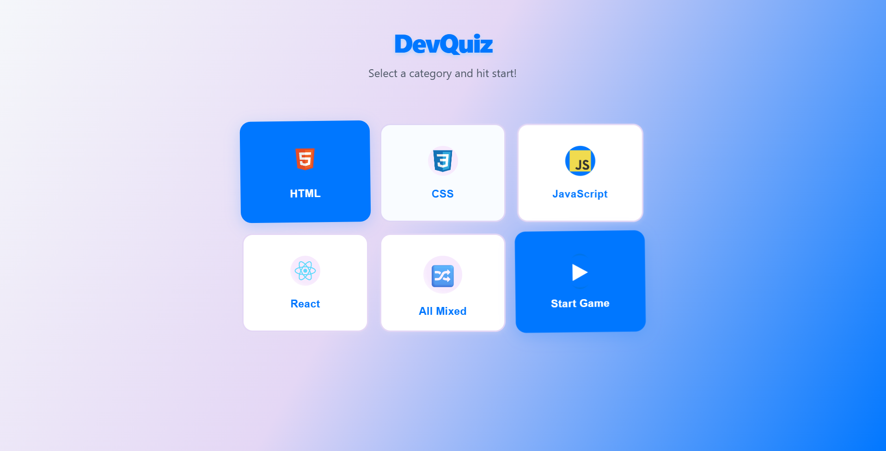
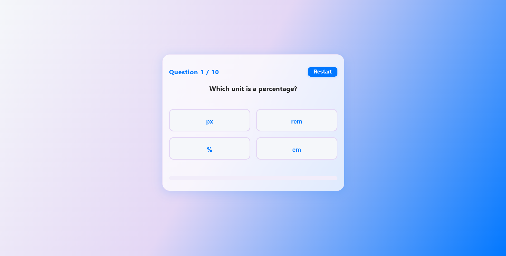
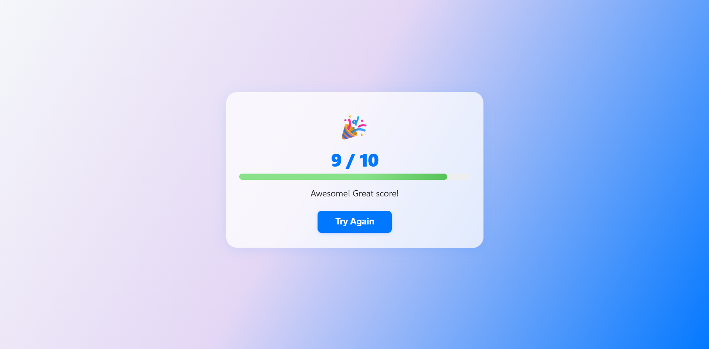

# DevQuiz — Quiz App

DevQuiz is a modern quiz application built with React, designed for speed and ease of use. Test your knowledge in various categories with a fresh, fully responsive interface.

---

## Demo

[Live Demo](https://your-demo-link.com) <!-- Replace with your deployment link if available -->

---

## Screenshots





---

## Features

- Quick category selection and instant quiz start
- Timer and animated progress bar
- Multiple-choice questions with instant feedback
- Audio and visual feedback for correct and incorrect answers, plus final score
- Personalized message and option to restart the quiz
- Responsive design, optimized for both mobile and desktop
- Modern look: clean colors, smooth transitions, visual effects, accessibility focus
- Easy keyboard navigation and visible button focus states

---

## Technologies Used

- React (functional components and hooks)
- Vite (for lightning-fast development and build)
- Custom CSS (all styles written from scratch for full control)
- No backend

---

## Project Structure

```
/src
  App.jsx           # Main app logic and state
  main.jsx          # React entry point
  index.css         # All custom styles, responsive and animations
  /components/      # Reusable UI components: QuizCard, Result, Button, etc.
  /data/            # Questions, categories, and quiz logic
  /hooks/           # Custom hooks (timer, score, etc.)
  /utils/           # Utility functions (e.g., shuffle, scoring)
  /logos/           # Logo and other visual assets
```

---

## How to Run Locally

1. Clone or download this repository
2. In the terminal, run:
    ```sh
    npm install
    npm run dev
    ```
3. Open [http://localhost:5173/](http://localhost:5173/) in your browser

---

## Requirements

- Node.js (v18+)
- VS Code (recommended)
- Useful extensions: ES7+ React/Redux snippets, Prettier

---

## About the CSS

All styles are custom-made, focusing on clean, DRY, and responsive code. Layouts and transitions are carefully crafted to ensure the app looks and works perfectly on any device, desktop or mobile.

---

## Author

Cosmin M. Rotaru  
[GitHub](https://github.com/CosminMRotaru)  
[LinkedIn](https://www.linkedin.com/in/marius-cosmin-rotaru-a8a242262/)


---

## License

MIT